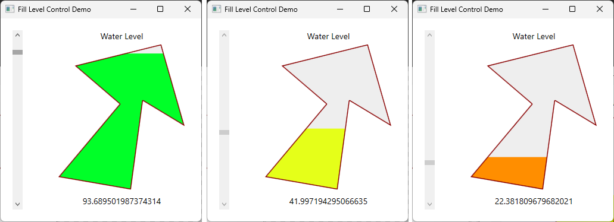
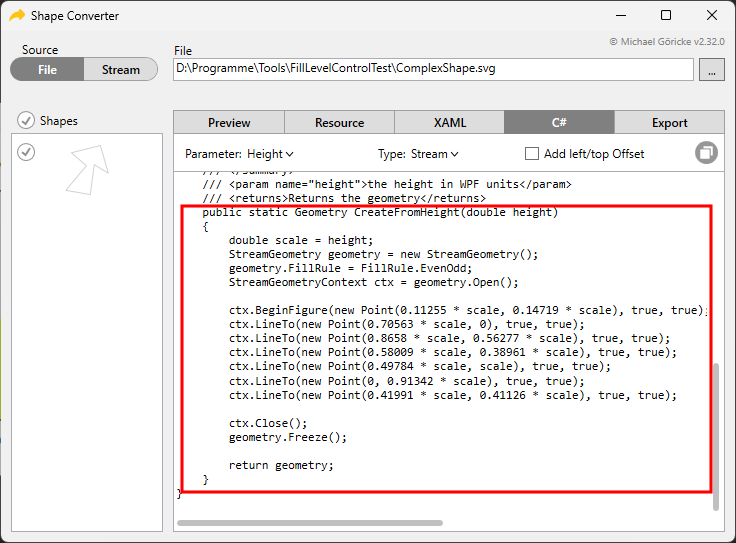

# Resizable Fill Level Control With Complex Shape

The task of creating a resizable fill level control with a complex shape isn't that easy. Everything that isn't rectangular or circular is regarded as complex. Suppose you need to create a fill level control that has the following shape. In addition the shape shall change it's inner color according to the fill level.



The shape in this example seems to be easy but of course isn't: no vertical or horizontal borders -> no standard way will work. Nowadays you get the shape from your designer. In general designers use Adobe Illustrator to create vector shapes. Your task is to move this shape into the WPF world.

Creating a bitmap out of the shape isn't optimal. Resizing bitmaps doesn't keep the quality of a vector graphic, especially if the final size isn't known at all.

The solution is to convert the vector file with the `ShapeConverter` (see repository next to this one here at Github) into C# code. The code creates a `Geometry` of the shape at runtime depending on the given height. This geometry in turn is used to clip a WPF control like a `Border`.



The converter `ShapeClipConverter` creates a geometry of the given size (using the unmodified code from the `ShapeConverter`). This geometry is used to set the `Clip` of a `Border`. Every child of the border `Part_Container` is clipped and the result is the desired shape.

```
<Border x:Name="Part_Container"
        Grid.Row="1"
        Background="#FFEEEEEE"
        Clip="{Binding ActualHeight,
                        Converter={StaticResource ShapeClipConverter},
                        ElementName=Part_Container}">
        <Grid>
            <Rectangle x:Name="Part_FillLevel"
                        VerticalAlignment="Bottom"
                        Fill="Red" />
            <Path Data="{Binding ActualHeight,
                                    Converter={StaticResource ShapeClipConverter},
                                    ElementName=Part_Container}"
                    Stretch="None"
                    Stroke="#ff880000"
                    StrokeThickness="3" />
        </Grid>
    </Border>

```

The implementation of the `FillLevelControl` is straight foreward. It sets the height and the color of the inner rectangle `Part_FillLevel` according to the fill level and corrects the rectangle's height when the control is resized.